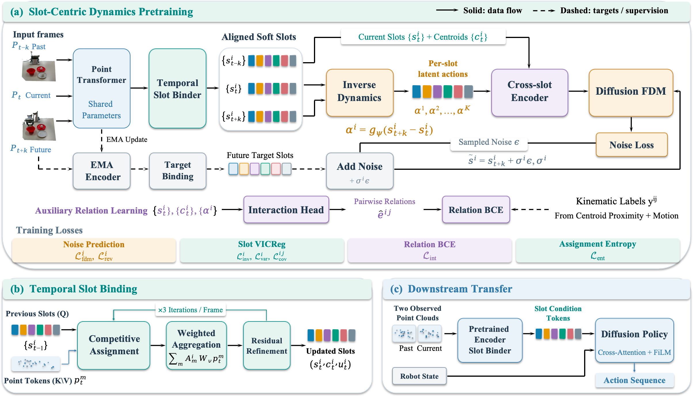

<div align="center">
  <h1>DynaSlots: Slot-Centric 3D Dynamics Pretraining for Robot Manipulation</h1>
</div>

<p align="center">
  
</p>

DynaSlots learns temporally consistent object slots from 3D point-cloud
observations and uses them to condition a diffusion policy. This repository
contains the training, evaluation, data-generation, and simulation code for
Adroit and Meta-World tasks.

## Installation

The tested setup uses Linux, Python 3.8, CUDA, and MuJoCo 2.1. See
[INSTALL.md](INSTALL.md) for the complete environment setup.

```bash
conda create -n dynaslots python=3.8 -y
conda activate dynaslots
pip install -e .
```

## Data

Datasets and checkpoints are intentionally not stored in Git. Put each Zarr
dataset under `data/` using the following naming convention:

```text
data/
├── adroit_pen_expert.zarr/
└── metaworld_bin-picking_expert.zarr/
```

Generate demonstrations after installing the simulation dependencies:

```bash
bash scripts/gen_demonstration_adroit.sh pen
bash scripts/gen_demonstration_metaworld.sh bin-picking
```

The Adroit generator requires the corresponding VRL3 expert checkpoint; see
[INSTALL.md](INSTALL.md#adroit-expert-checkpoints).

## Training

Pretrain the DynaSlots visual representation:

```bash
bash scripts/pretrain_dynaslots.sh adroit_pen run1 0 0
```

Train and evaluate the diffusion policy from the resulting representation:

```bash
bash scripts/train_dynaslots_policy.sh adroit_pen run1 0 0
bash scripts/eval_dynaslots_policy.sh adroit_pen run1 0 0
```

Arguments are `task_name`, `run_name`, `seed`, and comma-separated GPU IDs.
For example, pass `0,1,2,3` as the last argument for four-GPU training. Set
`RESUME=true` to resume representation pretraining.

The relation-gated experiment uses the corresponding scripts:

```bash
bash scripts/pretrain_rgp_dynaslots.sh adroit_pen run1 0 0
bash scripts/train_rgp_dynaslots_policy.sh adroit_pen run1 0 0
```

Outputs are written to `data/outputs/` and `data/outputs_policy/`; both are
ignored by Git.

## Repository layout

```text
dynaslots/     Core models, policies, environments, datasets, and configs
scripts/       Demonstration, training, and evaluation entry points
tests/         Unit tests for slot binding and policy conditioning
third_party/   Required simulation dependencies without generated artifacts
pretrain.py    Representation pretraining entry point
train.py       Diffusion-policy training entry point
eval.py        Policy evaluation entry point
```

## License

The DynaSlots code is released under the MIT License. Bundled third-party
components retain their original licenses.
